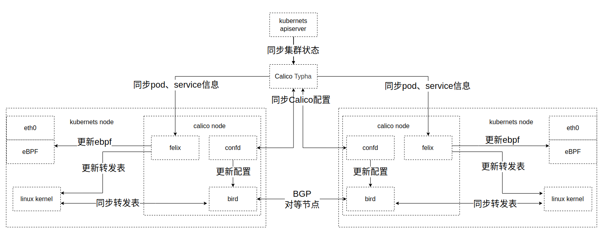
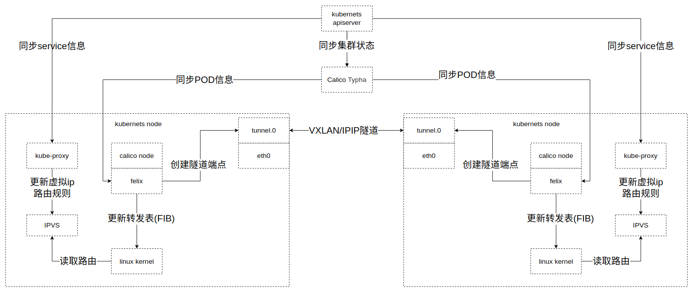
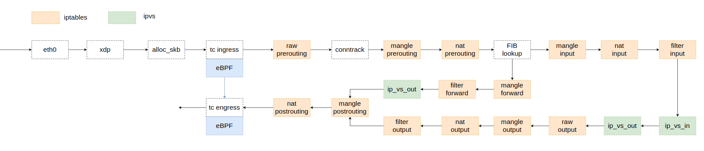

1.	容器网络的一些名词说明
- bgp：边界网关协议，一种中心化自治路由协议。它通过维护IP路由表或“前缀”表来实现自治系统之间的可达性
- vxlan：虚拟扩展局域网，是对传统VLAN协议的一种扩展，将L2的以太帧封装到UDP报文（即L2 over L4）中，并在L3网络中传输
- ipip：IP in IP，一种IP隧道协议，将一个IP数据包，封装进另一个IP数据包中。为了封装IP数据包，在来源IP上要再加上一个外部的标头，隧道的进入点，目的位置，以及隧道离开的位置
- netfilter：Linux内核中的包过滤框架，用于管理网络封包，提供5个Hook
    - NF_IP_PRE_ROUTING: 接收到的包进入协议栈后立即触发此 hook，在进行任何路由判断 （将包发往哪里）之前
    - NF_IP_LOCAL_IN: 接收到的包经过路由判断，如果目的是本机，将触发此 hook
    - NF_IP_FORWARD: 接收到的包经过路由判断，如果目的是其他机器，将触发此 hook
    - NF_IP_LOCAL_OUT: 本机产生的准备发送的包，在进入协议栈后立即触发此 hook
    - NF_IP_POST_ROUTING: 本机产生的准备发送的包或者转发的包，在经过路由判断之后， 将触发此 hook
- iptables：用户空间中用于配置Linux包过滤规则集的工具，使用table來组织规则，每个table内部规则被进一步组织为chain，由hook触发
    - chain分类：
        - PREROUTING: 由 NF_IP_PRE_ROUTING hook 触发
        - INPUT: 由 NF_IP_LOCAL_IN hook 触发
        - FORWARD: 由 NF_IP_FORWARD hook 触发
        - OUTPUT: 由 NF_IP_LOCAL_OUT hook 触发
        - POSTROUTING: 由 NF_IP_POST_ROUTING hook 触发
    - table分类：
        - raw：标记包NOTRACK，使包不会被conntrack（连接追踪）处理
        - mangle：用于处理数据
        - nat：用于网络地址转换
        - filter：用于过滤数据包
- ipvs：IP Virtual Server，是在 netfilter 上层构建的，作为 Linux 内核的一部分，实现传输层负载均衡，IPVS 可以将基于 TCP 和 UDP 服务的请求定向到真实服务器，并使真实服务器的服务在单个IP地址上显示为虚拟服务，注册NF_IP_LOCAL_IN、 NF_IP_FORWARD、NF_INET_LOCAL_OUT
- eBPF：是一项起源于Linux内核，可以在特权上下文中运行沙盒程序的技术
    - XDP：eXpress Data Path，定义了一个受限的执行环境，运行在一个 eBPF 指令虚拟机中，支持在网络设备驱动ingress附加eBPF程序
- tc：Traffic Control，Linux流量控制框架
- skb：Linux网络包数据结构
- FIB：Forward Information Base，是一个將mac映射到端口的动态表，优化了目标地址的快速查找，提供高效的路由转发
2. Kubernetes网络网络主要分为两个部分：pod网络（pod內容器相互访问、集群內pod相互访问）、service网络(集群外部网络访问、仅集群内部访问服务)
- pod网络由kubernetes网络插件提供，当前选择插件为calico，calico默认采用全网格拓扑结构，每个与其他节点构成BGP对等节点，calico node主要由三个部分组成：felix、confd、bird
    - felix与kubernetes etcd同步pod信息生成路由並写入Linux内核
        - Calico Typha缓存kubernetes数据、去重，减少节点与kubernetes etcd的直接连接降低负载
    - bird读取内核转发表通过bgp协议將路由同步到对等节点
    - confd读取calico配置更新到bird
- service网络默认由kube-proxy提供，kube-proxy依据service配置通过ipvs/iptables创建虚拟ip，负载均衡到实际pod
    - kubernetes中pod是一种非永久性资源，pod的ip地址在销毁创建后会发生变化，service定义了逻辑上的一组pod，提供访问策略
    - 通过在calico中启用eBPF，可替代kube-proxy+ipvs，提供更高效的网络处理
3. calico eBPF + BGP
    - Calico node同步kubernetes集群状态，组编路由写入Linux内核转发表，及eBPF Map，並通过BGP协议与其他节点同步路由

        

4. kube-proxy + calico IPIP
    - Calico node同步Kubernetes集群信息，组编路由写入Linux内核转发表，创建隧道端点同其他节点隧道端点连接，kube-proxy处理service信息，將规则写入ipvs

        

5. 网络数据包处理流程
    - 在kube-proxy+ipvs模式下，数据包需经过netfilter（iptables、ipvs）路由到目标
    - ebpf模式下，数据包在tc ingres hook直接通过ebpf map取得目标地址绕过netfilter

    

