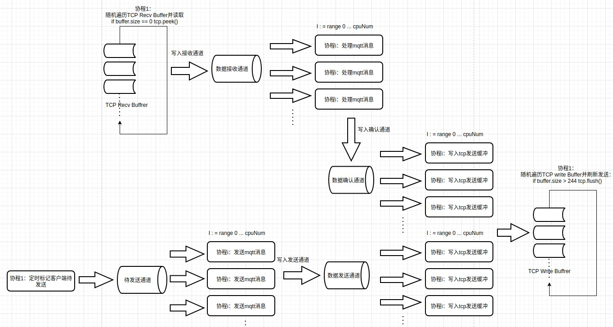

## paho.mqtt.golang消息发送解析&修改源码增强压力测试能力

在使用paho.mqtt对Mqtt服务器进行压力测试时，每个mqtt连接都是一个协程，大量协程上下文切换占用大量CPU时间，无法满足测试需求，就tcp连接而言，mqtt客户端只有两种动作，读取tcp接收缓冲/写入tcp发送缓冲，通过统一保存mqtt连接，使用少量协程遍历mqtt连接对应的接收缓冲读取mqtt报文，再使用少量协程遍历mqtt连接将报文写入发送缓冲，增加单机可建立mqtt连接数量。

在paho.mqtt.golang的client.go中mqtt客户端定义如下（删减部分字段）
```go
type client struct {
	...
	obound    chan *PacketAndToken // outgoing publish packet
	oboundP   chan *PacketAndToken // outgoing 'priority' packet (anything other than publish)
	msgRouter *router              // routes topics to handlers
	persist   Store
	options   ClientOptions
	optionsMu sync.Mutex // Protects the options in a few limited cases where needed for testing

	conn   net.Conn   // the network connection, must only be set with connMu locked (only used when starting/stopping workers)
    ...
}
```
查看客户端的消息发送方法Publish()，可以看到消息没有直接发送，而是将生成的报文写入了obound通道。
```go
func (c *client) Publish(topic string, qos byte, retained bool, payload interface{}) Token {
    ...
		DEBUG.Println(CLI, "sending publish message, topic:", topic)
		publishWaitTimeout := c.options.WriteTimeout
		if publishWaitTimeout == 0 {
			publishWaitTimeout = time.Second * 30
		}
		select {
		case c.obound <- &PacketAndToken{p: pub, t: token}:
		case <-time.After(publishWaitTimeout):
			token.setError(errors.New("publish was broken by timeout"))
		}
    ...
}
```
代码中搜索obound使用，找到在startCommsWorkers()方法中客户端中单独启动了一个协程，从obound中取出消息再放到commsobound通道中，commsobound通道的读取在net.go中的startComms()函数中。
```go
func (c *client) startCommsWorkers(conn net.Conn, inboundFromStore <-chan packets.ControlPacket) bool {
	...
	// c.oboundP and c.obound need to stay active for the life of the client because, depending upon the options,
	// messages may be published while the client is disconnected (they will block unless in a goroutine). However
	// to keep the comms routines clean we want to shutdown the input messages it uses so create out own channels
	// and copy data across.
	commsobound := make(chan *PacketAndToken)  // outgoing publish packets
	commsoboundP := make(chan *PacketAndToken) // outgoing 'priority' packet
	c.workers.Add(1)
	go func() {
		defer c.workers.Done()
		for {
			select {
			case msg := <-c.oboundP:
				commsoboundP <- msg
			case msg := <-c.obound:
				commsobound <- msg
			...
			}
		}
	}()

    commsIncomingPub, commsErrors := startComms(c.conn, c, inboundFromStore, commsoboundP, commsobound)
    ...
}
```
startComms()函数继续调用了startOutgoingComms()，使用一个新的协程读取obound通道数据，再将读取到的消息写入tcp发送缓冲。
```go
func startComms(conn net.Conn, // Network connection (must be active)
	c commsFns, // getters and setters to enable us to cleanly interact with client
	inboundFromStore <-chan packets.ControlPacket, // Inbound packets from the persistence store (should be closed relatively soon after startup)
	oboundp <-chan *PacketAndToken,
	obound <-chan *PacketAndToken) (
	<-chan *packets.PublishPacket, // Publishpackages received over the network
	<-chan error, // Any errors (should generally trigger a disconnect)
) {
	// Start inbound comms handler; this needs to be able to transmit messages so we start a go routine to add these to the priority outbound channel
	ibound := startIncomingComms(conn, c, inboundFromStore)
	outboundFromIncoming := make(chan *PacketAndToken) // Will accept outgoing messages triggered by startIncomingComms (e.g. acknowledgements)

	// Start the outgoing handler. It is important to note that output from startIncomingComms is fed into startOutgoingComms (for ACK's)
	oboundErr := startOutgoingComms(conn, c, oboundp, obound, outboundFromIncoming)
    ...
}

func startOutgoingComms(conn net.Conn,
	c commsFns,
	oboundp <-chan *PacketAndToken,
	obound <-chan *PacketAndToken,
	oboundFromIncoming <-chan *PacketAndToken,
) <-chan error {
	go func() {
		for {
			select {
			case pub, ok := <-obound:
				...
				if err := msg.Write(conn); err != nil {
					...
					continue
				}
                ...
			case msg, ok := <-oboundp:
				...
			case msg, ok := <-oboundFromIncoming: 
            ...
			}
		}
	}()
	return errChan
}
```
startComms()函数中还调用startIncomingComms()函数接收服务器发送的mqtt报文，函数中主要有3个协程在处理读取工作
- 协程1 在startIncoming()函数，读取tcp缓冲，解析为mqtt报文,发送到inbound通道
- 协程2 在startIncomingComms()函数，读取inbound通道,按报文类型依据mqtt协议处理报文,将需要响应的报文发送到output通道，
- 协程3 在startComms()函数，在读取output通道转发到outboundFromIncoming通道，而outboundFromIncoming通道在之前startOutgoingComms()中处理，写入到tcp发送缓冲
```go

func startIncoming(conn io.Reader) <-chan inbound {
	ibound := make(chan inbound)
	go func() {
		for {
			if cp, err = packets.ReadPacket(conn); err != nil {
				...
			}
			ibound <- inbound{cp: cp}
		}
	}()
	return ibound
}

func startIncomingComms(conn io.Reader,
	c commsFns,
	inboundFromStore <-chan packets.ControlPacket,
) <-chan incomingComms {
	ibound := startIncoming(conn) // Start goroutine that reads from network connection
	output := make(chan incomingComms)

	go func() {
		for {
            ...
			var msg packets.ControlPacket
			var ok bool
			select {
			case msg, ok = <-inboundFromStore:
				...
			case ibMsg, ok := <-ibound:
                ...
				msg = ibMsg.cp
                ...
			}

			switch m := msg.(type) {
			...
			case *packets.PublishPacket:
				output <- incomingComms{incomingPub: m}
			case *packets.PubackPacket:
			...
			}
		}
	}()
	return output
}

func startComms(...) {
    ibound := startIncomingComms(conn, c, inboundFromStore)
    ...
    go func() {
		for ic := range ibound {
			...
			if ic.outbound != nil {
				outboundFromIncoming <- ic.outbound
				continue
			}
			...
		}
    ...
	}()
    ...
}
```
为了使用协程统一读取/发送数据，取消startCommsWorkers()，由外部协程管理进行实际数据读取/发送，mqtt客户端内部发送将数据发到外部通道，用bufio包装连接，暴露到外部，供外部协程读写tcp缓冲，进行实际tcp读写。

定义ClientPool保存mqtt连接、读取到的/需发送的的mqtt报文
 - addClientChan：接收新添加的mqtt客户端，使用协程读取该通道，将客户端写入clientsWheel、comns
 - clientsWheel：将客户端按初始化时间保存为一个时间轮，使用协程遍历时间轮，发送当前轮次客户端keep-alive报文
 - comns：保存所有mqtt客户端
 - router：mqtt主题订阅回调路由
 - worker：工作协程数量
 - commsoIncoming：接收到的mqtt报文
 - oboundFromIncoming：处理接收报文后需响应的报文
 - commsobound：需要发送的报文
 - commsoboundP：本地持久化的未发送完成报文

 ```go
type ClientPool struct {
	addClientChan      chan *client
	clientsWheel       [][]*client
	comns              []*client
	router             *router
	worker             int
	commsoIncoming     chan *ComnsInbound
	oboundFromIncoming chan *ComnsPacket
	commsobound        chan *ComnsPacket
	commsoboundP       chan *ComnsPacket
}
```

一次mqtt消息发送流程：
- 使用库的调用者通过mqtt客户端发送消息，消息会写入commsobound通道
- 协程1从commsobound通道读取到需发送报文,编码报文写入客户端对应bufio.Writer
- 协程2遍历到客户端bufio.Writer有数据,将数据写入下层tcp发送缓冲
- 协程3遍历到客户端bufio.Reader有数据，读取数据解析为报文，发送到commsoIncoming通道
- 协程4从commsoIncoming通道读取到服务器报文处理，如需响应则将响应报文写入oboundFromIncoming
- 协程1从oboundFromIncoming通道读取到需发送报文，编码报文写入客户端对应bufio.Writer


添加新的内部报文，将mqtt报文同对应客户端关联
```go 
type ComnsPacket struct {
	packet *PacketAndToken
	c      *client
}
type ComnsInbound struct {
	err error
	cp  packets.ControlPacket
	c   *client
}
```
修改mqtt客户端结构，将报文发到obound/oboundP通道需要客户端信息，用bufio包装conn为bufio.Reader/bufio.Writer让读/写都立即完成，不会阻塞当前协程。
```go
type client struct {
	obound    chan *ComnsPacket // outgoing publish packet
	oboundP   chan *ComnsPacket // outgoing 'priority' packet (anything other than publish)

	conn   net.Conn // the network connection, must only be set with connMu locked (only used when starting/stopping workers)
	reader *bufio.Reader
	writer *bufio.Writer
}
```
添加新的新建mqtt客户端函数，在外部传入的obound/oboundP通道，使所有客户端共用发送通道。
```go
func newComnsClient(o *ClientOptions, obound, oboundP chan *ComnsPacket) Client {
	c := &client{}
    ...
	c.obound = obound
	c.oboundP = oboundP
	return c
}
```
添加函数无阻塞的读取tcp缓冲函数，当缓冲区无数据时立即返回nil。
```go
func ReadPacketNoBlocking(r *bufio.Reader) (ControlPacket, error) {

	size := r.Buffered()
	if size == 0 {
		r.Peek(1)
		return nil, nil
	} else if size < 4 {
		fmt.Println("Buffered < 4::", size)
	}
    ...
}
```
将startIncomingComms()中的报文处理逻辑抽取出来，作为单独的函数。
```go
func resolveIncomingComms(msg packets.ControlPacket,
	c commsFns,
) *incomingComms {

	c.persistInbound(msg)
	c.UpdateLastReceived()

	switch m := msg.(type) {
	case *packets.PingrespPacket:
		c.pingRespReceived()
	...
	case *packets.PubcompPacket:
		c.getToken(m.MessageID).flowComplete()
		c.freeID(m.MessageID)
	}

	return nil
}

```
实现随机顺序遍历mqtt连接，读取tcp缓冲，发送到commsoIncoming通道。
```go
func (cp *ClientPool) startConnReading() {
	num := cp.worker * 2

	ioChan := make(chan *client, num*100)
	newIoReader := func() {
		for {
			c := <-ioChan
			if !c.IsConnected() || c.conn == nil {
				continue
			}
			p, err := packets.ReadPacketNoBlocking(c.reader)
			if err != nil {
				if !strings.Contains(err.Error(), "unsupported packet type") {
					cp.commsoIncoming <- &ComnsInbound{err: err, c: c}
				}
				continue
			}
			if p != nil {
				cp.commsoIncoming <- &ComnsInbound{cp: p, c: c}
			}
		}
	}

	for i := 0; i < num; i++ {
	    go newIoReader()
	}

	for {
		size := len(cp.comns)
		if size == 0 {
			time.Sleep(time.Millisecond * 500)
			continue
		} else {
			time.Sleep(time.Microsecond * 100)
		}
		for _, idx := range rand.Perm(size) {
			if cp.comns[idx] != nil {
				ioChan <- cp.comns[idx]
			}
		}
	}
}
```
实现commsoIncoming通道读取，处理接收到的mqtt报文。
```go
func (cp *ClientPool) StartIncoming() {
	for i := 0; i < cp.worker; i++ {
		go func() {
			for ci := range cp.commsoIncoming {
				cp.Count.CountChan <- &CountMsg{t: 2, n: 1}

				if ci.err != nil {
					ERROR.Println(ci.err)
					continue
				}

				in := resolveIncomingComms(ci.cp, ci.c)
				if in != nil {
					if in.err != nil {
						ERROR.Println(in.err)
						ci.c.internalConnLost(in.err)
						continue
					}
					if in.outbound != nil {
						cp.oboundFromIncoming <- &ComnsPacket{in.outbound, ci.c}
						continue
					}
					if in.incomingPub != nil {
						cp.router.matchAndDispatch(in.incomingPub, ci.c.options.Order, ci.c, cp.commsoboundP)
					}
				}
			}
		}()
	}
}
```
实现commsobound/commsoboundp/commsoIncoming通道读取，将待发送数据写入内部缓冲。
```go
func (cp *ClientPool) StartOutcoming() {

	for i := 0; i < cp.worker; i++ {
		go func() {
			for {
				pack, ok := <-cp.commsobound
				...
				c.RWMutex.Lock()
				if err := msg.Write(pack.c.writer); err != nil {
					ERROR.Println("outgoing obound reporting error ", err)
					pack.packet.t.setError(err)
					// report error if it's not due to the connection being closed elsewhere
					if !strings.Contains(err.Error(), closedNetConnErrorText) {
						ERROR.Println(err)
					}
					continue
				}
				c.RWMutex.Unlock()
				...
			}
		}()
	}
	for i := 0; i < cp.worker; i++ {
		go func() {
			for {
				pack, ok := <-cp.oboundFromIncoming
				cp.Count.CountChan <- &CountMsg{t: 3, n: 1}
				if !ok {
					continue
				}
				c := pack.c
				c.RWMutex.Lock()
				if err := pack.packet.p.Write(pack.c.writer); err != nil {
					ERROR.Println("outgoing oboundFromIncoming reporting error", err)
					if pack.packet.t != nil {
						pack.packet.t.setError(err)
					}
					continue
				}
				c.RWMutex.Unlock()
				c.UpdateLastSent()
			}
		}()
	}
    ...
}
```
实现随机遍历mqtt连接，将待发送数据写入tcp发送缓冲。
```go
func (cp *ClientPool) startConnWritinging() {
	num := cp.worker
	ioChan := make(chan *client, num*100)

	newIoWriter := func() {
		for {
			c := <-ioChan
			if !c.IsConnected() || c.conn == nil {
				continue
			}

			buffered := c.writer.Buffered()

			if buffered > 244 {
				c.RWMutex.Lock()
				err := c.writer.Flush()
				c.RWMutex.Unlock()
				if err != nil {
					ERROR.Println("io flush error :", err)
				}
			}
		}
	}

	for i := 0; i < num; i++ {
	    go newIoWriter()
	}

	for {
		size := len(cp.comns)
		if size == 0 {
			time.Sleep(time.Millisecond * 500)
			continue
		} else {
			time.Sleep(time.Microsecond * 100)
		}
		for _, idx := range rand.Perm(size) {
			if cp.comns[idx] != nil {
				ioChan <- cp.comns[idx]
			}
		}
	}
}
```
实现通过时间轮定时发送keep-alive。
```go
func (cp *ClientPool) startKeepalive() {
	pingTicker := time.NewTicker(time.Second * 1)
	defer pingTicker.Stop()
	idx := 0

	for range pingTicker.C {
		idx = idx % 30
		for _, c := range cp.clientsWheel[idx] {
			...
			if time.Since(lastSentTime) >= time.Duration(c.options.KeepAlive*int64(time.Second)) || time.Since(lastReceivedTime) >= time.Duration(c.options.KeepAlive*int64(time.Second)) {
				if atomic.LoadInt32(&c.pingOutstanding) == 0 {
					ping := packets.NewControlPacket(packets.Pingreq).(*packets.PingreqPacket)
					// We don't want to wait behind large messages being sent, the Write call
					// will block until it it able to send the packet.
					atomic.StoreInt32(&c.pingOutstanding, 1)
					if err := ping.Write(c.writer); err != nil {
						ERROR.Println(PNG, err)
					}
					
					c.lastSent.Store(time.Now())
					pingSent = time.Now()
				}
			}
        ...
		}
		idx++
	}
}
```
经修改paho.mqtt源码，原在测试机上只能维持几千的连接，在单机上可以维持数万连接，降低了进行压力测试的硬件需求。

[完整代码](https://github.com/nananatsu/paho.mqtt.golang/tree/v1.3.4-stress-test)